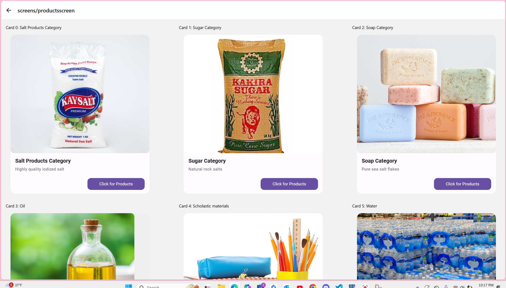

# Welcome to BulkMart ❤️
Inspired to break a stagnant industru in supply chain bulkmart exists to ease the burdens of seller a one stop shop to manage all your products and inventory.For Buyers owning schools it assists them buy products online easily  and to sellers they can better manage their products through built in analytics.This is BulkMart your one stop shop to wholesale extravaganza
About Project
BulkMart showcases navigation of different screens, use of clear landing pages, built in end to end analytics using Postgres SQL and buyer simulation pipeline mirroring an
Amazon clone

## Get started

1. Install dependencies

   ```bash
   npm install
   ```

2. Start the app
npm run start
This project runs concurrently with both the front and backend working in sync monitored by root ReactNativeProject

4 To check database run psql -U postgres -d --your database

In the output, you'll find options to open the app in a

- [development build](https://docs.expo.dev/develop/development-builds/introduction/)
- [Android emulator](https://docs.expo.dev/workflow/android-studio-emulator/)
- [iOS simulator](https://docs.expo.dev/workflow/ios-simulator/)
- [Expo Go](https://expo.dev/go), a limited sandbox for trying out app development with Expo

You can start developing by editing the files inside the **app** directory. This project uses [file-based routing](https://docs.expo.dev/router/introduction).

## Get a fresh project

When you're ready, run:

```bash
npm run reset-project
```

This command will move the starter code to the **app-example** directory and create a blank **app** directory where you can start developing.
## Tech stack
Technologies
React Native
Typescript
Tailwind Css
Material UI design theme
Postgres SQL
NodeJS
Express

## Challenges
Broken apis
-Limited permissions for different users when granting access levels to users
-Passing in data front and back without changing what is expected for it to return
-Database and system delay in changing and reading of environment variables

## Solutions
- Restarting my entire system seemed to work especially failing to read in database changes or new packages
- Using postman was a great help as it helped me debug the entire system entirely to isolate the api 
- Most important the console.logs and the developer tools in browser were good at showing me where the api was breaking and in what places the apis were not 
working





## Other project
-This project uses:
- [Material-UI (MUI)](https://mui.com/) for React components and layout.
- [Tailwind CSS](https://tailwindcss.com/) for utility-first styling.
- landing page was Adopted and customized from the [Astrolus template](https://astro.build/themes/details/astrolus/). Typescript version(Bulkmart screen)
- All images used in this project are free to use and sourced from online resources.